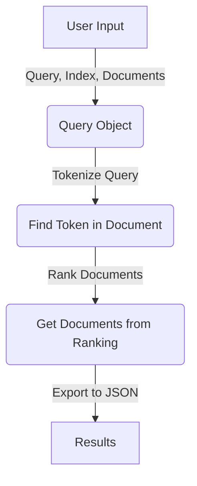

# RankWeb

## Overview

The goal of this project is to create a query ranking tool for web searches. The tool takes a user-input query and returns a list of relevant documents, with web pages represented by their titles and URLs. The default behavior stores the results in a `results.json` file, sorted by relevance.



## Getting Started

To begin, clone the repository:

```bash
git clone https://github.com/odi77/web-query-expansion.git
cd web-query-expansion
```

Next, set up a virtual environment

```python
python3 -m venv venv
source venv/bin/activate
pip install -r requirements.txt
```

Once the environment is set up, run the ranking process through the command line interface (CLI). Explore the available options using the following command:

```bash
# get some help
python3 main.py --help
# run the app with default values
python3 main.py
# run with pre-specified query
python3 main.py --query "write your query"
```

## Contributors
[Cyrille NEBANGA](https://github.com/odi77)
