# RankWeb

## Overview

The goal of this project is to create a query ranking tool for web searches. The tool takes a user-input query and returns a list of relevant documents, with web pages represented by their titles and URLs. The default behavior stores the results in a `results.json` file, sorted by relevance.

```mermaid
graph TD;
  A[Start] -->|Initialize| B[Create Utils object];
  B -->|Read JSON files| C[Read index and documents];
  C -->|Initialize Query| D[Create Query object];
  D -->|Tokenize Query| E[Tokenize the input query];
  E -->|Find Token in Document| F[Find documents containing query tokens];
  F -->|Rank Documents| G[Rank documents based on token count];
  G -->|Get Documents from Ranking| H[Extract document titles and URLs];
  H -->|Export Ranking| I[Export ranked documents to JSON];
  I -->|End| J[End];
  J -->|Command Line| K[User executes command];
  K -->|Read Input| L[Read command line input];
  L -->|Initialize| M[Initialize Utils object];
  M -->|Read JSON files| N[Read index and documents];
  N -->|Initialize Query| O[Create Query object];
  O -->|Tokenize Query| P[Tokenize the input query];
  P -->|Find Token in Document| Q[Find documents containing query tokens];
  Q -->|Rank Documents| R[Rank documents based on token count];
  R -->|Get Documents from Ranking| S[Extract document titles and URLs];
  S -->|Export Ranking| T[Export ranked documents to JSON];
  T -->|End| U[End];
```



## Getting Started

To begin, clone the repository:

```bash
git clone https://github.com/odi77/web-query-expansion.git
cd web-query-expansion
```

Next, set up a virtual environment

```python
python3 -m venv venv
source venv/bin/activate
pip install -r requirements.txt
```

Once the environment is set up, run the ranking process through the command line interface (CLI). Explore the available options using the following command:

```bash
python3 main.py
```

By default, the values are:
* `--index "data/title_pos_index.json"` $\rightarrow$ Default index
* `--documents "data/documents.json"` $\rightarrow$ Default documents
* `--query "casting dans le monde du divertissement"` $\rightarrow$ Query for castings in entertainment
* `--path "."` $\rightarrow$ Output results at the root of the project
* `--file "results.json"` $\rightarrow$ Output query results in `results.json` file
* `--lang "fr"` $\rightarrow$ French

Alternatively, you can run the program with specified query and language using the following command:
```bash
python3 main.py --index "data/title_pos_index.json" --documents "data/documents.json" --query "recette de cuisine" --path "." --file "results.json" --lang "fr"

```

## Contributors
[Cyrille NEBANGA](https://github.com/odi77)
